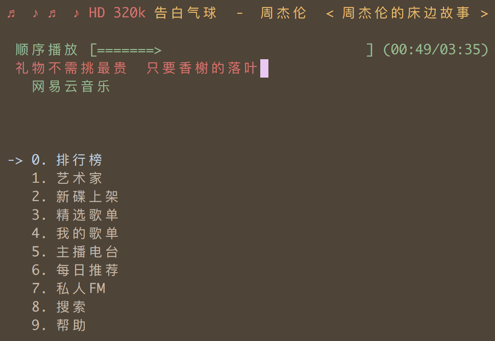

高品质网易云音乐命令行版本，简洁优雅，丝般顺滑，基于Python编写。
##### 以下是树莓派上安装步骤：
~~~
sudo apt-get install python-dev mpg123
sudo pip install Netease-MusicBox
~~~
如果报pip相关的错误，可能需要安装 pip：
~~~
sudo apt-get install python-pip
~~~
使用软件：
~~~
musicbox
~~~
上下移动：J、K

确认：Enter

播放：Space

其它操作参加其[Github](https://github.com/darknessomi/musicbox)页面

